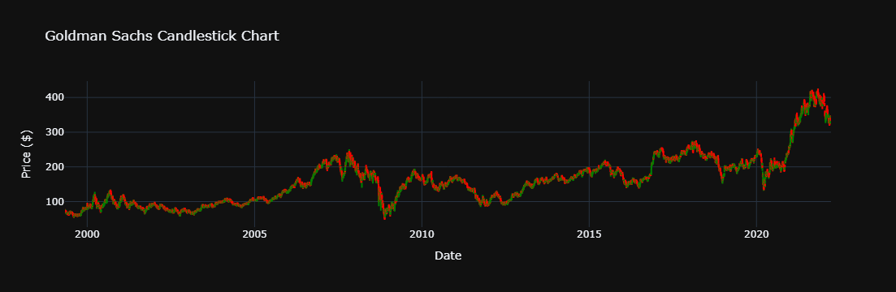
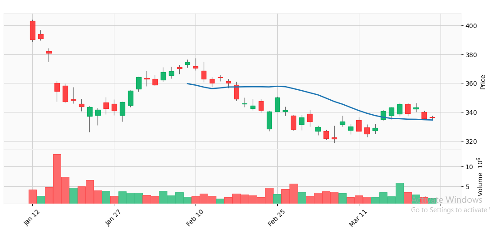
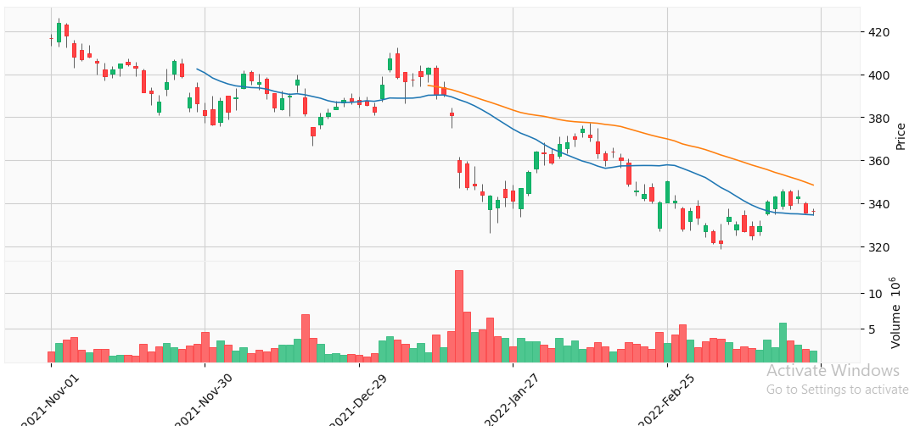
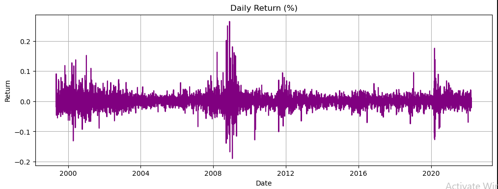

---

# 📊 Goldman Sachs Stock Analysis Report

---

## 🧰 Tech Stack Used

- 🐍 Python (Pandas, NumPy)
- 📊 Matplotlib, Seaborn, mplfinance, Plotly (static screenshots)
- 📗 Jupyter Notebook
- 🧠 ta (Technical Analysis Indicators)
- 🧾 Markdown for documentation
- 💾 Git/GitHub for version control

## 🕯️ 1. Interactive Candlestick Chart (Screenshot)

---

## 🕯️ 2. Candlestick Chart 1

---

## 🕯️ 3. Candlestick Chart 2

---

## 📉 4. Daily Returns

---

## 📌 Summary

- Daily returns and candlestick patterns indicate key movement zones.
- Technical indicators were used for trend and momentum analysis.
- This report is built from real financial data using Python.

---

## 🧑‍💼 Author

*Your Name*  
_Data Analyst_ | [GitHub](https://github.com/mukut45) | [LinkedIn](https://linkedin.com/in/mukutdutta/)
