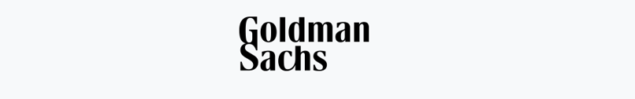

---

# 📊 Goldman Sachs Stock Analysis Report

---

## 🧰 Tech Stack

| Category      | Tools Used                                                                 |
|---------------|-----------------------------------------------------------------------------|
| 🐍 Language    |         |
| 📊 Libraries  | `pandas`, `numpy`, `matplotlib`, `seaborn`, `plotly`, `mplfinance`, `ta`   |
| 📗 Notebook   | `Jupyter Notebook`                                                          |
| 🧾 Reporting  | `Markdown`                                                                  |
| 💾 Versioning | `Git`, `GitHub`                                                             |

## 🕯️ 1. Interactive Candlestick Chart (Screenshot)

---

## 🕯️ 2. Candlestick Chart 1

---

## 🕯️ 3. Candlestick Chart 2

---

## 📉 4. Daily Returns

---

## 📌 Summary

- Daily returns and candlestick patterns indicate key movement zones.
- Technical indicators were used for trend and momentum analysis.
- This report is built from real financial data using Python.

---

## 🧑‍💼 Author

*Mukut May Dutta*  
_Data Analyst_ | [GitHub](https://github.com/mukut45) | [LinkedIn](https://linkedin.com/in/mukutdutta/)
